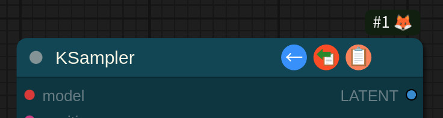

# comfyui-connection-helper
This is a helper extension for ComfyUI that assists with node connections.

When you hover over a node with your mouse, an icon appears.

- **Left Button**: Clicking this button connects the closest available output from nodes on the left side to any empty input slots on the node.
- **Center Button**: Clicking this button duplicates all input connections of the closest node.
  - The duplication feature only works for matching slot names and does not disconnect any already connected connections.
- **Right Button**: Clicking this button duplicates all connections of the closest node. (However, this can only be used when all inputs and outputs are empty.)

